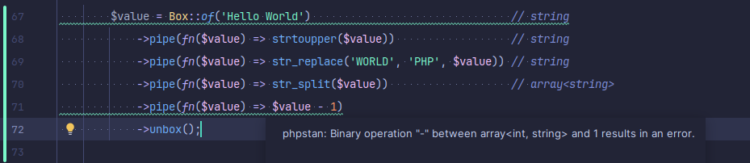

# Welcome to PhpBox

PhpBox contains exactly one class: `Box`.

You can find it here: [src/Box.php](src/Box.php)

# Installation
Currently, there is no composer package. 

Simply copy the `Box.php` file to your project and adjust its namespace if needed.

# Requirements
The only hard requirement is PHP 8.0 or higher.

However, I STRONGLY recommend using PHPStan at level 8 or higher to get the most out of this helper.

# Local Testing and Development (Optional)
If you want to run the tests or play around with the code, read
the [CONTRIBUTING.md](CONTRIBUTING.md) file.

# Usage
You put any value into a box.

Then you can chain map(), dump() and assert() calls on it.

To get the value out of the box, call unbox() or get().

## Note
In an earlier version:
- map() was called pipe()
- get() was called pull()

## Examples

```php
$value = Box::of(5)
    ->map(fn($value) => $value + 1)
    ->map(fn($value) => $value * 2)
    ->unbox();

echo $value; // 12
```

Use get() to combine map() and unbox() in one call:
```php
$value = Box::of(5)
    ->map(fn($value) => $value + 1)
    ->get(fn($value) => $value * 2);

echo $value; // 12
```

Perform assertions or dump the value inline:
```php
$isEven = fn($value) => $value % 2 === 0;

$value = Box::of(5)
    ->map(fn($it) => $it + 1)->assert(6)
    ->map(fn($it) => $it * 2)->assert($isEven)->dump()
    ->unbox();

echo $value; // 12
```

Transform values into anything you want:
```php
$toGreeting = fn($name) => "Hello, $name!";
$toGreetingResource = fn($item) => ['text' => $item, 'length' => strlen($item)];
$toJsonStrict = fn($item) => json_encode($item, flags: JSON_THROW_ON_ERROR);

$value = Box::of('World')
    ->map($toGreeting)
    ->map($toGreetingResource)
    ->get($toJsonStrict);

echo $value; // {"text":"Hello, World!","length":13}
```

You could validate an email address and create a user like this if you wanted to:
```php
$user = Box::of($inputEmail)
    ->assert(is_string(...))
    ->assert(fn($it) => strlen($it) > 0 && strlen($it) < 256)
    ->assert(fn($it) => filter_var($it, FILTER_VALIDATE_EMAIL) !== false)
    ->get(fn($it) => $userRepository->create(['email' => $it]));
```

# Type Safety
Thanks to meticulously crafted PHPDoc annotations, this class is type safe if you use PHPStan for static analysis.

`Box` is a generic class, so you can specify the type of the value it contains.

```php
/**
* @template T
*/
class Box
{
    /**
     * @param T $value
     */
    public function __construct(private mixed $value)
    {
    }
}
```

Small **ad break** for [Scala](https://www.scala-lang.org/). The same code in Scala 3 looks like this:
```scala
case class Box[T](value: T)
```
/ad-break

The `@template T` annotation tells PHPStan that the class is generic and that the type of the value is T.
In the constructor, we use the $value parameter with the type T,
and the type of the Box is automatically reverse engineered from the input.


Examples:
- `Box::of(5)` will be of type `Box<int>`
- `Box::of('hello')` will be of type `Box<string>`
- `Box::of([['hello' => 'world'], ['bye' => 'mars']])` will be of type `Box<array<array<string, string>>`

If you do not understand what these pointy brackets mean, you should read up on Generic Types.
Every language on the planet except PHP has them. Thanks to PHPStan, we can have them too.
Just with lots more (keyboard) typing.

Have a look at the map() method
```php
/**
 * Apply a transformation function to the value.
 *
 * @template U
 * @param callable(T): U $callback
 * @return Box<U>
 */
public function map(callable $callback): Box
{
    return new self($callback($this->value));
}
```
It takes a callback that transforms our current value of type T into a new value of type U.
U can be anything, including the same type as T. Again, we have reverse engineering at work here, where
the type of U, and the resulting `Box<U>` is inferred from the return type of the callback.

This mechanism is incredibly powerful at preventing you from writing bad code. And again, a totally normal feature
in other languages like Java, Scala, Kotlin, Haskell, Rust, F#, C#, Go, Swift, TypeScript.
Please pick one of these and learn it.

```php
$value = Box::of('Hello World')                               // string
    ->map(fn($value) => strtoupper($value))                  // string 
    ->map(fn($value) => str_replace('WORLD', 'PHP', $value)) // string
    ->map(fn($value) => str_split($value))                   // array<string>
    ->get(fn($value) => $value - 1); // phpstan: Binary operation "-" between array<int, string> and 1 results in an error.
```
In the last transformation, I try to subtract 1 from an array of strings. An unsound operation to say the least.
PHPStan will catch this guaranteed error and tell you about it. Without writing any tests.

You just have to install PHPStan and configure your PHPStorm or VSCode to run it on every save.
And more importantly, add it to your pipeline so it runs on every commit,
and prevent guaranteed bad code from ever reaching production. Of course bugs can still reach prod,
but removing those that are obvious even to a machine is a good start. (What is obvious to a machine however greatly
depends on the strength of your type system.
PHPStan is not [Idris](https://docs.idris-lang.org/en/latest/tutorial/theorems.html#totality-checking),
but it's a start.)

Here is a screenshot of PHPStan in action (I added comments for reader convenience):


What you are seeing in this screenshot is called Type-Safety. Something that is being taken a bit more seriously
in PHP since 7.4, and VERY seriously by the creators of TypeScript, who decided JavaScript is a menace to society.
Unfortunately, Laravel itself as well as its following has tendency to produce code that is often impossible
to reason about statically. This holds especially true for its Pipeline facade, which is absolutely type-unsafe
(i.e. errors like the one I demonstrated above can NOT be caught at compile time).
Therefore, I see a legitimate need for my Box class.

# Resources
Quick start guide for how to set up PHPStan in Laravel:  
[https://refactorers-journal.ghost.io/adding-phpstan-to-a-laravel-application/](https://refactorers-journal.ghost.io/adding-phpstan-to-a-laravel-application/)

More on my Box class, type-safety and how to deal with PHPStan on level 9:  
[https://refactorers-journal.ghost.io/type-safe-pipe-in-php-part-2/](https://refactorers-journal.ghost.io/type-safe-pipe-in-php-part-2/)